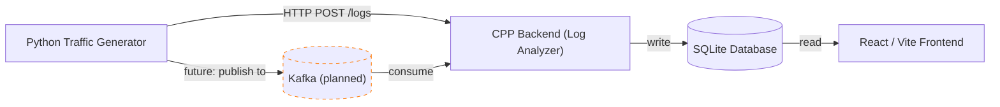

# RealTime Log Analyser

## Overview

RealTime Log Analyser is a full-stack observability prototype combining a C++ analytics backend with a React/Vite frontend dashboard. The backend receives JSON log events, processes them using streaming algorithms, stores summary metrics in SQLite, and exposes HTTP analytics APIs. The frontend visualizes visitor trends, top domains, and suspicious IP activity.

## System Architecture

- **Traffic ingestion**: The backend container runs a Python traffic generator (`backend/scripts/generate_traffic.py`) that streams synthetic log events into the C++ processing pipeline.
- **C++ analytics backend**: The backend listens on `0.0.0.0:8080`, accepts log events on `/logs`, and exposes dashboard APIs under `/api/*`.
- **Data storage**: A local SQLite store maintains aggregated metrics and security insights.
- **Frontend dashboard**: The React/Vite app runs on `5173` and fetches analytics data from the backend.
- **Docker Compose**: `docker-compose.yml` orchestrates the backend and frontend containers together.

## Architecture Diagram

Below is a Mermaid diagram showing the current data flow and the planned insertion of Kafka between the traffic generator and the C++ backend (Kafka is marked as a future component).



**Note:** Kafka is shown as a planned/future component. Currently, `generate_traffic.py` posts directly to the backend's `/logs` endpoint; in the future producers can publish to Kafka and the backend will consume from it.

### Backend responsibilities

- Receives streaming log payloads via `POST /logs`
- Updates in-memory analytics using probabilistic data structures:
  - `BloomFilter` for suspicious IP detection
  - `CountMinSketch` for frequency estimation
  - `HyperLogLog` for approximate unique visitor counting
  - `SpaceSaving` for identifying top domains
- Persists hourly aggregates and top domain data to SQLite
- Serves JSON dashboard endpoints:
  - `GET /api/visitors`
  - `GET /api/domains`
  - `GET /api/suspicious`

### Frontend responsibilities

- Runs a modern Vite development server
- Uses React 19 for UI composition
- Uses Recharts for charting and visualizations
- Fetches analytics data from the backend APIs and renders the dashboard in-browser

## Tech Stack

- Backend
  - C++17
  - CMake build system
  - SQLite3 for local storage
  - `cpp-httplib` for lightweight HTTP server routing
  - `nlohmann::json` for JSON serialization
  - Python 3 for synthetic traffic generation
- Frontend
  - React 19
  - Vite development server
  - Recharts for charts
  - Lucide React for iconography
  - ESLint for code quality
- Containerization
  - Docker
  - Docker Compose

## Getting Started

### Prerequisites

- Docker installed
- Docker Compose available

### Run the full stack

From the repository root:

```bash
docker-compose up --build
```

This will:

1. Build the backend image from `backend/Dockerfile`
2. Build the frontend image from `frontend/Dockerfile`
3. Start the backend service on port `8080`
4. Start the frontend service on port `5173`

### Access the app

- Frontend dashboard: `http://localhost:5173`
- Backend analytics API: `http://localhost:8080`

### Notes

- The backend Docker container launches the Python traffic generator and pipes events into the compiled binary.
- The frontend depends on the backend and is configured to communicate with it over the exposed ports.

## Project Structure

```
RealTime_Log_Analyser/
├── docker-compose.yml
├── README.md
├── backend/
│   ├── CMakeLists.txt
│   ├── Dockerfile
│   ├── include/
│   │   ├── BloomFilter.h
│   │   ├── CountMinSketch.h
│   │   ├── DatabaseManager.h
│   │   ├── HashUtils.h
│   │   ├── HyperLogLog.h
│   │   ├── LogReceiver.h
│   │   └── SpaceSaving.h
│   ├── scripts/
│   │   └── generate_traffic.py
│   ├── src/
│   │   ├── BloomFilter.cpp
│   │   ├── CountMinSketch.cpp
│   │   ├── DatabaseManager.cpp
│   │   ├── HashUtils.cpp
│   │   ├── HyperLogLog.cpp
│   │   ├── LogReceiver.cpp
│   │   ├── main.cpp
│   │   └── SpaceSaving.cpp
│   └── third_party/
│       └── httplib.h
└── frontend/
    ├── Dockerfile
    ├── eslint.config.js
    ├── index.html
    ├── package.json
    ├── package-lock.json
    ├── public/
    │   └── icons.svg
    ├── src/
    │   ├── App.css
    │   ├── App.jsx
    │   ├── assets/
    │   ├── index.css
    │   └── main.jsx
    └── vite.config.js
```

